### Instalacja i konfiguracja MetaMask

1. instalujemy addon MetaMask https://metamask.io/ (Chrome, Firefox, Opera)
1. po instalacji powinna być dostępna ikonka MetaMask na głównym pasku przeglądarki
1. klikamy ikonkę MetaMask
1. ustawiamy sieć `Ropsten Test Network`
1. czytamy i akceptujemy Privacy Notice i ToS

    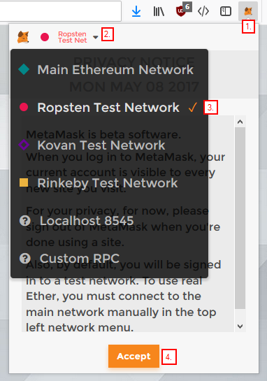
1. tworzymy lub importujemy portfel:
    * jeśli nie posiadamy portfela to tworzymy go przez wpisanie nowego hasła i potwierdzenie 1. przyciskiem `Create`
        > zapisujemy w bezpieczne miejsce wygenerowany sekretny klucz
    * jeśli importujemy, to wymagane jest dodatkowo podanie wcześniej zapisanego sekretnego klucza składającego się z dwunastu słów

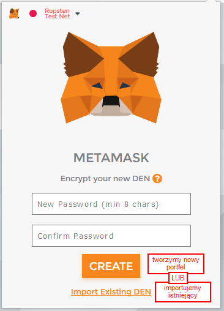 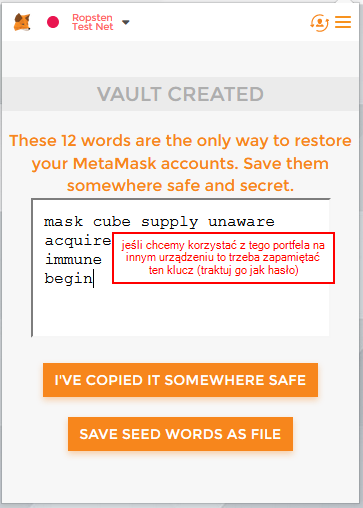

### Zasilenie konta

1. jeśli nie posiadamy żadnych funduszy na koncie to klikamy przycisk `Buy` i następnie `Ropsten Test Faucet` - w testowej sieci ether jest darmowy tylko trzeba o niego 'poprosić'

    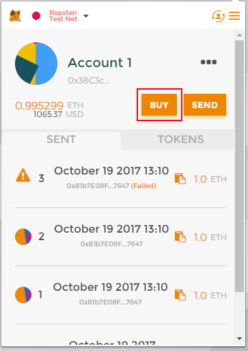 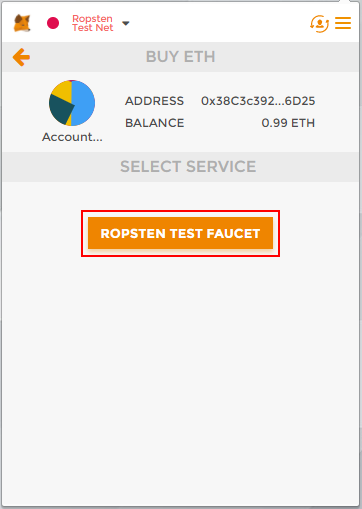
1. otworzy się nowa zakładka - klikamy `request 1 ether from faucet`
1. po chwili w sekcji `transactions` pojawi się link do naszej transakcji proszącej o ether - klikamy na niego by sprawdzić jej status

    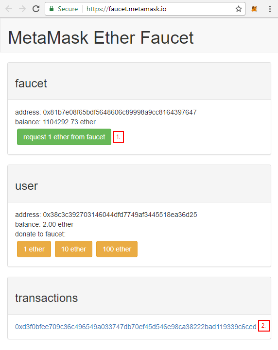 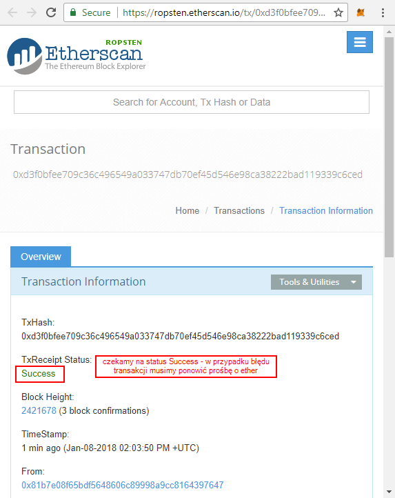
1. klikając na ikonkę MetaMask możwmy potwierdzić że nasze konto zostało zasilone

    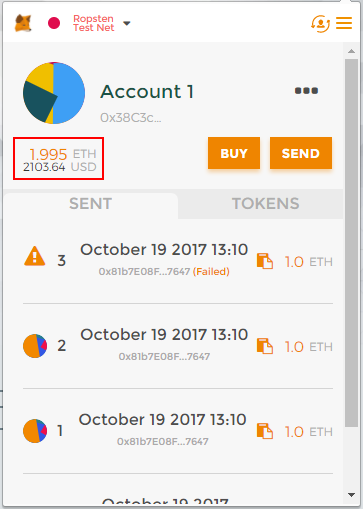

### Aplikacja SmartEvent

Aplikacja dostępna jest pod adresem http://kpimeetup.ml

1. klikamy SignUp na wydarzeniu `KPI 12.01.2018`
1. wpisujemy nick i potwierdzamy

    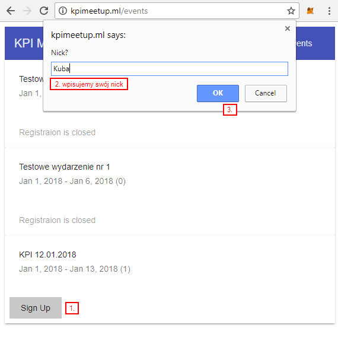
1. po chwili MetaMask powinien nas powiadomić o transakcji do potwierdzenia - klikamy ikonkę MetaMask jeśli samo nie pojawi się okienko
1. jeśli *Gas Limit* to 50000 to zwiększamy go o jedno dodatkowe zero (w tej chwili jest bug, że aplikacja nie wpisuje poprawnej ilości gazu do zużycia i wstawiane jest domyślne 5000. Ilość zużywanego gazu wynika z braku optymalizacji kontraktu, ale na testowej sieci nam to nie przeszkadza)
1. klikamy `Submit`

    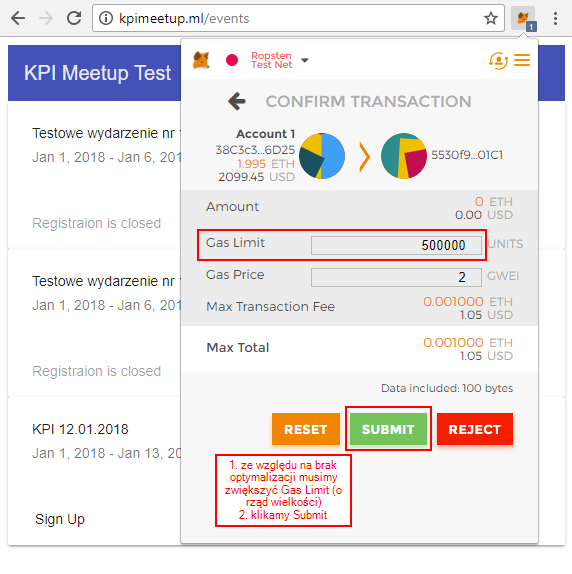
1. w historii (zakładka `Sent`) powinna pojawić się transakcja z odpowiednią ikonką: oczekująca (ikonka `...`), przeprocesowana (ikonka wielokolorowego koła) lub błędna (znak ostrzeżenia)
1. klikamy na ikonkę transakcji, sprawdzamy jej status i czekamy na przeprocesowanie (analogicznie jak przy dodawaniu ether'u do konta)
1. wracamy na http://kpimeetup.ml/events i odświeżamy stronę - przy wydarzeniu `KPI 12.01.2018` powinna teraz widnieć informacja `Already Signed Up`

### Tokeny SmartEvent

Po potwierdzeniu aktywności przez organizatora (ktoś od nas pewnie kliknie) zostaną przydzielone tokeny dla użytkownika - można sprawdzać stan token'ów w MetaMask:

1. klikamy ikonkę MetaMask
1. zakładka `Tokens`
1. przycisk `Add Token`
1. w `Token Contract Address` wpisujemy `0x3E2A550FB4CB7658819964f074F2B6787303557b`
1. w `Token Symbol` wpisujemy `MET` (możemy własną nazwę wybrać)
1. przycisk `Add`

Jak otrzymamy jakieś tokeny to będą one widoczne na tej zakładce:

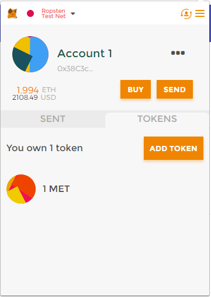
